<div align="center">


<br>

<a href="https://github.com/aditya-kg">
  
</a>

<br>

<a href="https://www.linkedin.com/in/adityaguru/"></a>
<a href="mailto:adityaguru.official@gmail.com"></a>
<a href="https://adityaguru.vercel.app/"></a>
<a href="https://scholar.google.com/citations?user=4UAtjHwAAAAJ&hl=en"></a>
<a href="https://huggingface.co/Adignite"></a>
<a href="https://www.kaggle.com/adignite"></a>

<br>


</div>

---

## `~/` whoami

```console
$ cat about.txt
```

Hi, I'm **Aditya Kumar Guru**, a Computer Science & Engineering (Data Science) undergraduate at **Manipal University Jaipur** and an applied AI / NLP researcher.

I work on **LLM robustness, reasoning, interpretability, inference efficiency, and Retrieval-Augmented Generation** — with a particular interest in turning research ideas into systems that are measurable, efficient, and usable.

- 🔬 Researching **LLM robustness, reasoning, inference optimization, and RAG**
- 📚 Published across **ACL, EACL, LREC, and AAAI Bridge**
- ⚙️ Building around **token halting, KV-cache optimization, quantization, RAG, PPO/RLHF, and evaluation**
- 🧪 Current focus: **runtime-only LLM acceleration and robustness under logical/semantic obfuscation**
- 🎓 **B.Tech. CSE (Data Science)** — Manipal University Jaipur
- 📫 **adityaguru.official@gmail.com**

<br>

<div align="center">

## `~/` toolbox

<!-- Research/toolbox radar: local SVG, no external API dependency -->
<picture>
  <source media="(prefers-color-scheme: dark)" srcset="assets/toolbox-radar.svg">
  <source media="(prefers-color-scheme: light)" srcset="assets/toolbox-radar.svg">
  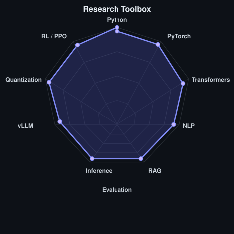
</picture>

<br>


<br><br>


</div>

---

<div align="center">

## `~/` research radar

<table>
<tr>
<td width="50%" align="center" valign="middle">
<picture>
  <source media="(prefers-color-scheme: dark)" srcset="assets/radar-dark.svg">
  <source media="(prefers-color-scheme: light)" srcset="assets/radar-light.svg">
  
</picture>
</td>
<td width="50%" align="center" valign="middle">
<picture>
  <source media="(prefers-color-scheme: dark)" srcset="assets/research-footprint-dark.svg">
  <source media="(prefers-color-scheme: light)" srcset="assets/research-footprint-light.svg">
  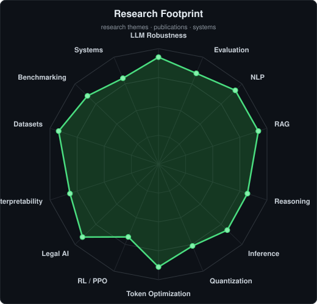
</picture>
</td>
</tr>
</table>

</div>

---

<div align="center">

## `~/` contribution activity


<br><br>

<picture>
  <source media="(prefers-color-scheme: dark)" srcset="https://raw.githubusercontent.com/aditya-kg/aditya-kg/output/snake-dark.svg">
  <source media="(prefers-color-scheme: light)" srcset="https://raw.githubusercontent.com/aditya-kg/aditya-kg/output/snake.svg">
  
</picture>

</div>

---

<div align="center">

## `~/` the numbers

<picture>
  <source media="(prefers-color-scheme: dark)" srcset="assets/card-stats-dark.svg">
  <source media="(prefers-color-scheme: light)" srcset="assets/card-stats-light.svg">
  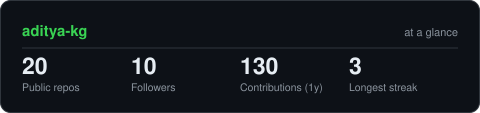
</picture>

<br>

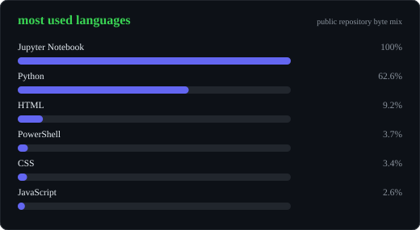

<br><br>

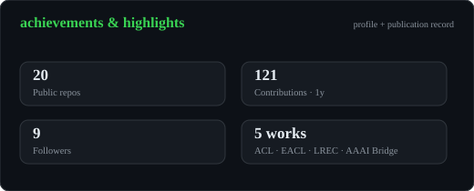

</div>

---

## `~/` publications

| Venue | Paper |
|---|---|
| **EACL 2026** | [Don't Judge a Book by its Cover: Testing LLMs' Robustness Under Logical Obfuscation](https://arxiv.org/abs/2602.01132) |
| **LREC 2026** | [ObfusQAte: Evaluating LLM Robustness on Obfuscated QA](https://arxiv.org/pdf/2508.07321v2) |
| **ACL 2025** | [SELF-PERCEPT: Introspection Improves Large Language Models' Detection of Multi-Person Mental Manipulation in Conversations](https://aclanthology.org/2025.acl-short.52/) |
| **AAAI Bridge 2026** | [ReGal: PPO-based Legal AI for Judgment Prediction & Summarization](https://bridge-ai-law.github.io/assets/pdf/nigam2026regal.pdf) |
| **Preprint / Research** | [QuickSilver — Speeding up LLM Inference through Dynamic Token Halting, KV Skipping, Contextual Token Fusion, and Adaptive Matryoshka Quantization](https://arxiv.org/abs/2506.22396) |

<details>
<summary><b>📖 Research highlights</b></summary>

<br>

**Logifus / EACL 2026** — A structure-preserving logical obfuscation framework and LogiQAte benchmark for testing whether LLMs rely on surface familiarity rather than underlying logical structure.

**ObfusQAte / LREC 2026** — A benchmark for robustness under semantic obfuscation, including Named-Entity Indirection, Distractor Indirection, and Contextual Overload.

**SELF-PERCEPT / ACL 2025** — A two-stage prompting framework for detecting multi-person, multi-turn mental manipulation in conversations.

**ReGal / AAAI Bridge 2026** — An RL-based legal reasoning framework using PPO and reward modeling for legal judgment prediction and summarization.

**QuickSilver** — A runtime-only inference optimization framework combining dynamic token halting, KV-cache skipping, contextual token fusion, and adaptive Matryoshka quantization.

</details>

---

## `~/` research timeline

```text
Apr 2026 – Sep 2026   SuperKalam                         AI Research Intern — RAG & content automation
Aug 2025 – Oct 2025   AryaXAI / Lexsi Labs              AI Research Intern — interpretability & inference optimization
Dec 2024 – Jun 2025   AI Institute of South Carolina     Research Intern — QuickSilver inference framework
Aug 2024 – Jun 2025   IISER Kolkata                     Research Intern — LLM robustness, reasoning & evaluation
May 2024 – Sep 2024   IIT Kanpur                        Summer Research Intern — ReGal PPO legal reasoning
```

---

## `~/` selected work

<table>
<tr>
<td width="50%">
  <a href="https://github.com/aditya-kg/ObfusQAte">
    <picture><source media="(prefers-color-scheme: dark)" srcset="assets/card-ObfusQAte-dark.svg"><source media="(prefers-color-scheme: light)" srcset="assets/card-ObfusQAte-light.svg">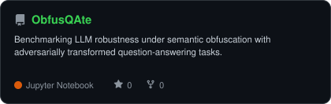</picture>
  </a>
</td>
<td width="50%">
  <a href="https://github.com/aditya-kg/LogiFus-NumSeries-Website">
    <picture><source media="(prefers-color-scheme: dark)" srcset="assets/card-LogiFus-NumSeries-Website-dark.svg"><source media="(prefers-color-scheme: light)" srcset="assets/card-LogiFus-NumSeries-Website-light.svg">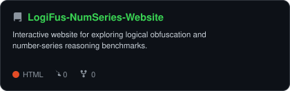</picture>
  </a>
</td>
</tr>
<tr>
<td width="50%">
  <a href="https://github.com/aditya-kg/OCR-project">
    <picture><source media="(prefers-color-scheme: dark)" srcset="assets/card-OCR-project-dark.svg"><source media="(prefers-color-scheme: light)" srcset="assets/card-OCR-project-light.svg">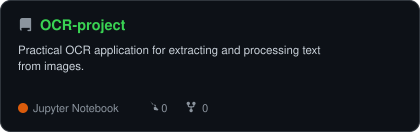</picture>
  </a>
</td>
<td width="50%">
  <a href="https://github.com/aditya-kg/Real-Time-Query_Expansion_amd_Topic-Tagging">
    <picture><source media="(prefers-color-scheme: dark)" srcset="assets/card-Real-Time-Query_Expansion_amd_Topic-Tagging-dark.svg"><source media="(prefers-color-scheme: light)" srcset="assets/card-Real-Time-Query_Expansion_amd_Topic-Tagging-light.svg">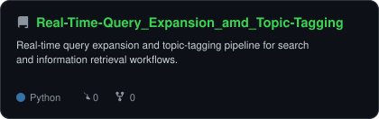</picture>
  </a>
</td>
</tr>
</table>

<sub>

| project | description |
|---|---|
| **[ObfusQAte](https://github.com/aditya-kg/ObfusQAte)** | LLM robustness under semantic obfuscation |
| **[LogiFus-NumSeries-Website](https://github.com/aditya-kg/LogiFus-NumSeries-Website)** | Interactive reasoning / benchmark explorer |
| **[OCR-project](https://github.com/aditya-kg/OCR-project)** | Practical OCR application |
| **[Real-Time-Query_Expansion_amd_Topic-Tagging](https://github.com/aditya-kg/Real-Time-Query_Expansion_amd_Topic-Tagging)** | Real-time query expansion and topic-tagging pipeline |
</sub>

---

<div align="center">

## `~/` awards & recognition

- 🥇 **1st Prize — Startup Weekend Jaipur (2024)** — innovation, teamwork and entrepreneurial spirit
- 🏅 **Best Presentation Award — ReGal, AAAI Bridge 2026**
- 🎓 **Dean's List / academic excellence**
- 📜 **Deep Learning Specialization** — DeepLearning.AI / Coursera
- 📜 **Machine Learning Specialization** — Andrew Ng / Coursera
- 📜 **Generative AI with LLMs** — DeepLearning.AI / AWS

</div>
