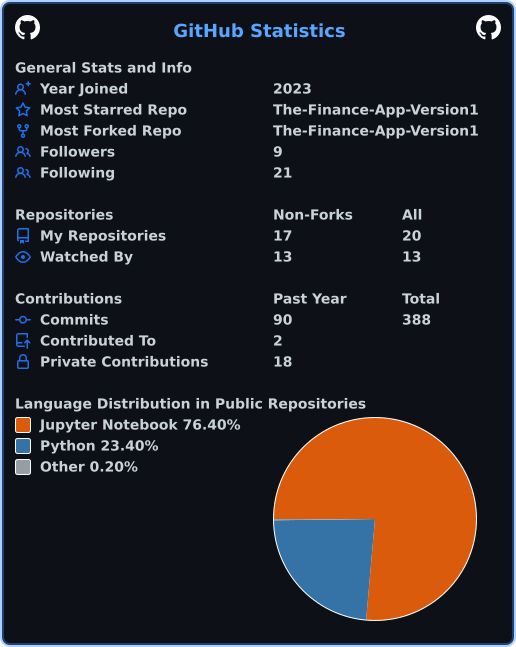
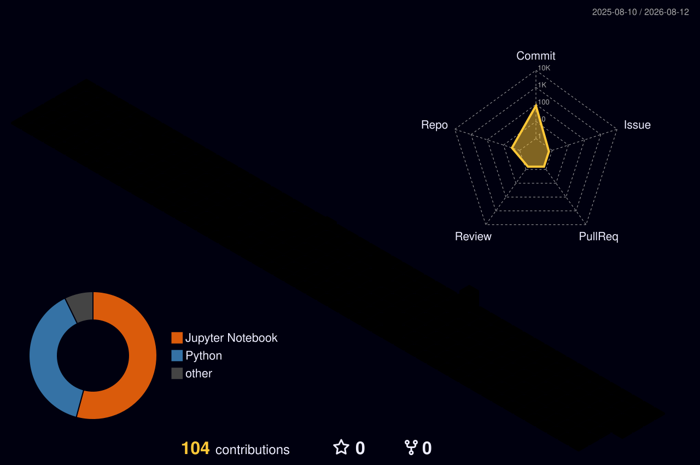

<div align="center">


<a href="https://readme-typing-svg.demolab.com">
  
</a>

<br/><br/>

<a href="https://adityaguru.vercel.app/"></a>
<a href="https://www.linkedin.com/in/adityaguru/"></a>
<a href="https://scholar.google.com/citations?user=4UAtjHwAAAAJ&hl=en"></a>
<a href="https://huggingface.co/Adignite"></a>
<a href="https://www.kaggle.com/adignite"></a>

<br/>


</div>

<br/>

## 🧠 About Me

- 🔭 Applied AI / NLP researcher working across **LLM robustness, interpretability, inference efficiency**, and **Retrieval-Augmented Generation**
- 📄 Published/under review at **ACL · EACL · LREC · AAAI Bridge**
- 🏫 Computer Science & Engineering (Data Science), Manipal University Jaipur — CGPA 9.22
- 🧪 Turning research on LLM robustness and inference efficiency into things that actually ship
- 🌱 Currently exploring runtime-only LLM acceleration: token halting, KV skipping, contextual token fusion, adaptive quantization
- 💬 Ask me about RAG pipelines, PPO/RLHF, or why your LLM inference is slower than it should be
- 📫 **adityaguru.official@gmail.com**

<br/>


## 📚 Publications

| Venue | Paper |
|---|---|
| **EACL 2026** | [Don't Judge a Book by its Cover: Testing LLMs' Robustness Under Logical Obfuscation](https://arxiv.org/abs/2602.01132) |
| **LREC 2026** | [ObfusQAte: Evaluating LLM Robustness on Obfuscated QA](https://arxiv.org/pdf/2508.07321v2) |
| **ACL 2025** | [SELF-PERCEPT: Multi-Person Mental Manipulation Detection](https://aclanthology.org/2025.acl-short.52/) |
| **AAAI Bridge 2026** | [ReGal: PPO-based Legal AI for Judgment Prediction & Summarization](https://bridge-ai-law.github.io/assets/pdf/nigam2026regal.pdf) |
| **Under Review** | QuickSilver — Speeding up LLM Inference through Token Halting & KV Skipping |

<details>
<summary><b>📖 Abstract summaries (click to expand)</b></summary>
<br/>

**Logifus (EACL 2026)** — A structure-preserving logical obfuscation framework that strips away surface-level familiarity, forcing models to rely on underlying logical structure rather than linguistic shortcuts; degrades LLM performance by up to 48.7% and suppresses late-layer confidence by 50–80%.

**ObfusQAte (LREC 2026)** — A framework and 1,024-question dataset benchmarking LLM robustness to obfuscated questions across Named-Entity Indirection, Distractor Indirection, and Contextual Overload; exposes 44–57% accuracy degradation under semantic obfuscation.

**SELF-PERCEPT (ACL 2025)** — A two-stage prompting framework inspired by Self-Perception Theory for detecting 11 types of multi-person, multi-turn mental manipulation in conversations; up to 0.47 F1 on MultiManip.

**ReGal (AAAI Bridge 2026)** — An RL-based legal reasoning framework integrating multi-task instruction tuning and RLAIF (PPO), evaluated on Indian court judgment prediction and legal summarization.

**QuickSilver (Under Review)** — A runtime-only framework accelerating LLM inference via dynamic token halting, KV skipping, contextual token fusion, and adaptive Matryoshka quantization — no retraining required.

</details>

<br/>

## 💼 Research Timeline

```text
Apr 2026 – Jun 2026   SuperKalam (YC-23)                        AI Research Intern — RAG & content automation
Aug 2025 – Oct 2025   AryaXAI (Lexsi Labs)                       AI Research Intern — Interpretability & inference optimization
Dec 2024 – Jun 2025   AI Institute of South Carolina (UofSC)     Research Intern — QuickSilver inference framework
Aug 2024 – Jun 2025   IISER Kolkata                              Research Intern — Logifus, ObfusQAte, SELF-PERCEPT
May 2024 – Sep 2024   IIT Kanpur                                 Summer Research Intern — ReGal PPO legal reasoning
```

<!-- <details>
<summary><b>🔍 Role details (click to expand)</b></summary>
<br/>

**SuperKalam (YC-23)** — Developed a UPSC question generation & quality-check pipeline using Vertex AI + RAG; built a library for automated question extraction and a social-media content dashboard using Remotion, Gemini, and Nano Banana models.

**AryaXAI (Lexsi Labs)** — Investigated interpretability and inference-efficiency methods, contributing to an optimization library; benchmarked inference frameworks to guide optimization strategy.

**AI Institute of South Carolina** — Built QuickSilver: implemented FLOP-reduction libraries, layer-wise evaluation pipelines, token halting and merging strategies.

**IISER Kolkata** — Contributed to Logifus (LogiQAte dataset creation, mechanistic interpretability via layer-wise log-probabilities), ObfusQAte (benchmarking, norm-drop analysis), and SELF-PERCEPT (MultiManip dataset, model evaluation, paper writing).

**IIT Kanpur** — Engineered PPO training pipelines with Hugging Face TRL for ReGal; evaluated reward models and benchmarked PPO on legal judgment prediction and summarization.

</details>

<br/> -->

## 🛠️ Tech Stack

<div align="center">


</div>

<details>
<summary><b>⚙️ Full stack, grouped (click to expand)</b></summary>
<br/>

**Languages**
<br/>


**Frameworks & Libraries**
<br/>


**Tools & Infra**
<br/>


**Techniques**
<br/>


</details>

<br/>


## 📊 GitHub Stats

<div align="center">

<!-- 
 -->



</div>

<br/>

## 🏆 Trophies & Achievements

<div align="center">

<!--  -->

</div>

<details>
<summary><b>🎓 Awards & recognitions (click to expand)</b></summary>
<br/>

- 🎓 Dean's List Certificate — Excellence in Academics
- 🥇 Startup Weekend Jaipur Winner (2024)
- 🏅 Best Presentation Award — ReGal, AAAI Bridge 2026
- ⭐ Student Excellence Award (2025)
- 📜 Deep Learning Specialization — Andrew Ng (DeepLearning.AI / Coursera)
- 📜 Generative AI with LLMs — DeepLearning.AI / AWS
- 📜 Machine Learning Specialization — Andrew Ng (Stanford / Coursera)

</details>

<!-- <br/>

## 🧊 Contribution Calendar

<div align="center">

</div>

<br/>

<div align="center"> -->

### 📫 Let's Connect

<a href="mailto:adityaguru.official@gmail.com"></a>
<a href="https://www.linkedin.com/in/adityaguru/"></a>
<a href="https://adityaguru.vercel.app/"></a>

<br/><br/>


</div>
